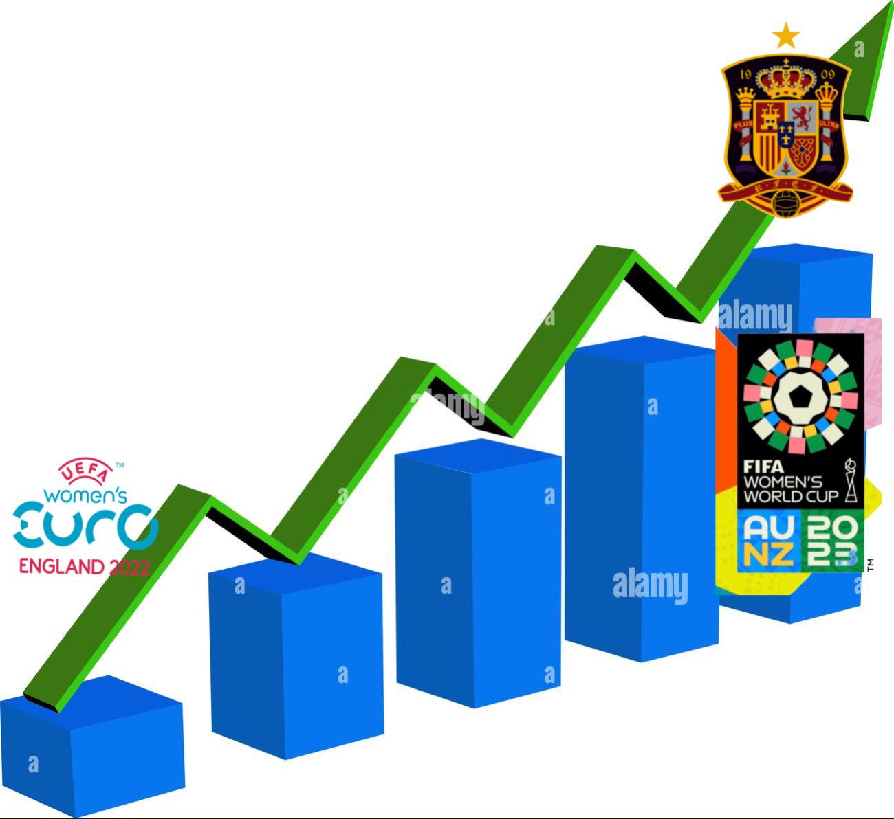
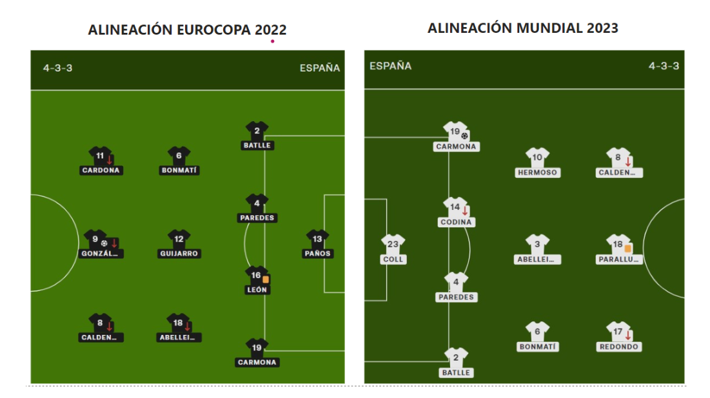
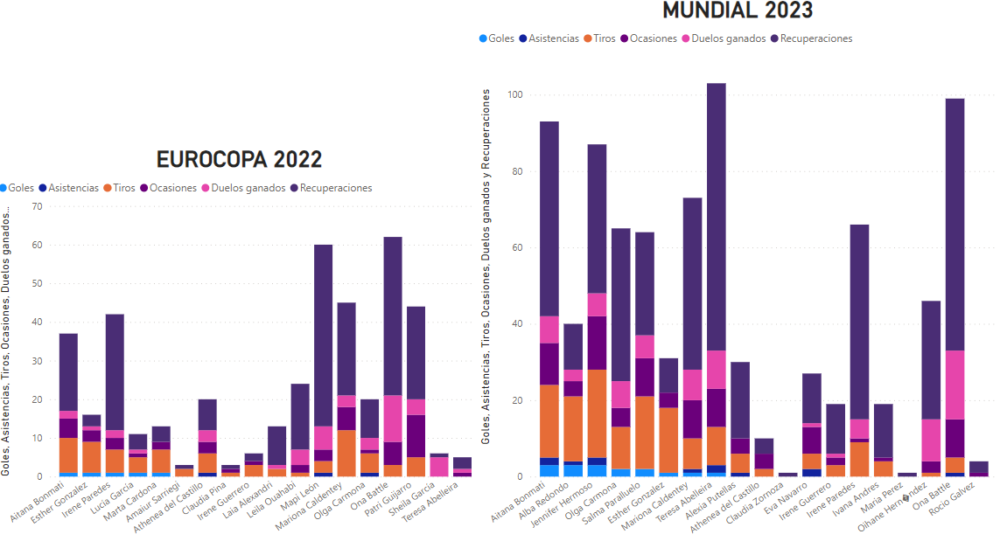
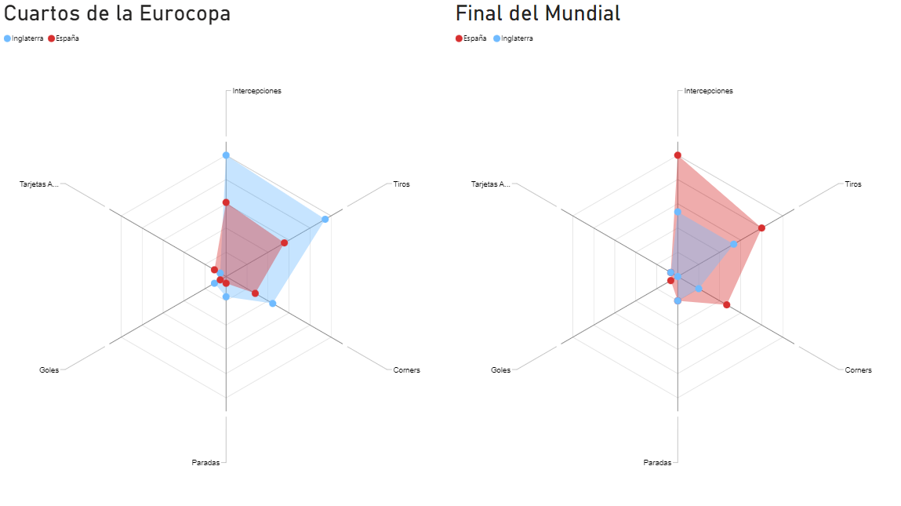
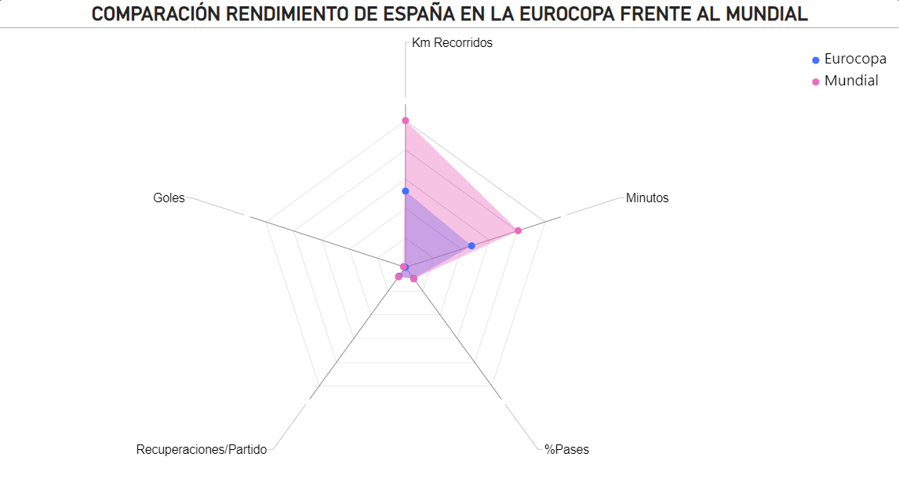
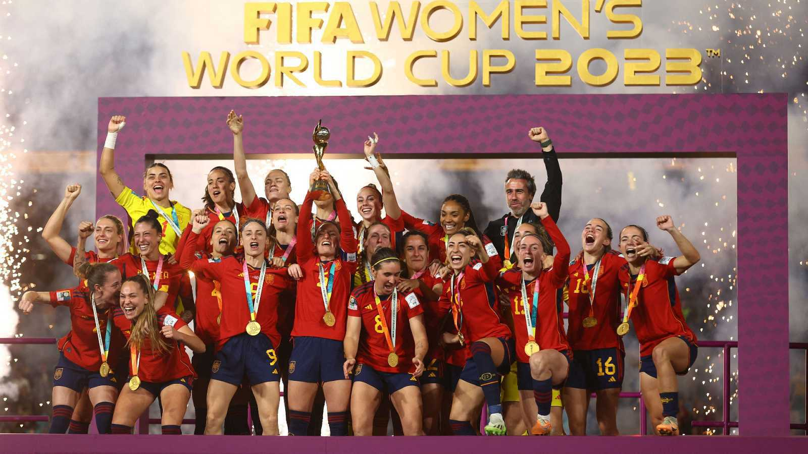
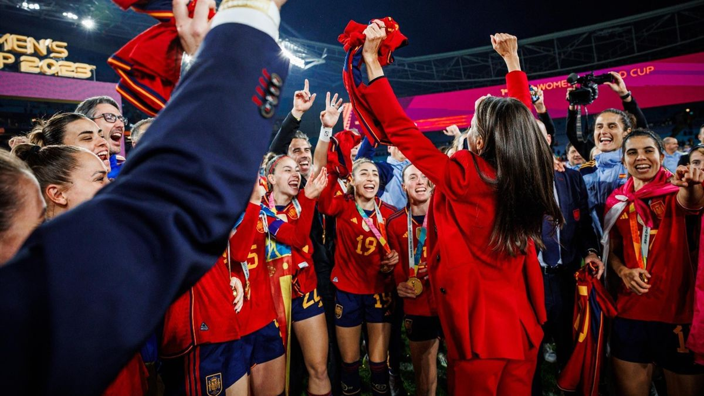

# PROYECTO FINAL 
## COMPARAR EL RENDIMIENTO DE LA SELECCIÓN ESPAÑOLA DE FUTBOL EN LA EUROCOPA DE 2022 Y EL MUNDIAL DE 2023

## Objetivo
Desde la Eurocopa del Verano de 2022 en la selección femenina de futbol se han realizado muchos cambios para mejorar el rendimiento general de la sección femenina y así conseguir mayores resultados, el objetivo de este proyecto es analizar a través de los datos de la selección, si estos cambios han conseguido que haya una evolución en el rendimiento de la Selección Femenina de Futbol o no. 

## Introducción
En este proyecto he recogido datos sobre el rendimiento de las jugadoras y del equipo en general tanto de la Eurocopa del 2022 como del Mundial de 2023 para poder ver las diferencias en cuanto a distintas estadísticas y comprobar que haya esa mejora haya ocurrido.
Por ultimo, he comparado el ultimo partido disputado en la Eurocopa (Cuartos de final) con el ultimo partido disputado en el Mundial (Final) que además fue contra el mismo rival, Inglaterra.

## Procedimiento
### ETL: Extract, Transform and Load:
Para la obtención de datos he escrapeado con python de multiples paginas web deportivas aun que la que más he acabado usando ha sido fbref.com .
Tras recoger los datos que necesitaba, los he transformado a csv para poder importar las tablas a PowerBi para la visualización.

## Visualización
He hecho un PowerBi Book con diferentes slides representando las diferencias del rendimiento del equipo en los dos torneos:
1. Las dos alineaciones iniciales:

2. Los minutos jugados por cada jugadora en los dos torneos y la diferencia de los minutos jugados por las jugadoras que han participado en los dos torneos:

3. Dos graficas en las que se pueden apreciar las diferencias generales del rendimiento de cada jugadora en los dos torneos:

4. Gráficas interactivas en las que se pueden apreciar las diferencias generales del rendimiento de cada jugadora en los dos torneos en cuanto a Goles, Tiros, Pases, Ocasiones creadas, Recuperaciones y Duelos:

5. Gráficas interactivas de la comparación del ultimo partido de la Eurocopa frente al ultimo partido del Mundial:

6. Gráfica tipo RADAR del punto 5:

7. Gráfica tipo RADAR del rendimeinto general de la selección española en la Eurocopa frente al Mundial:

En base a los datos y las representaciones de los mismos se puede confirmar que ha habido una evolución en cuanto al rendimiento de la selección en este último año.

